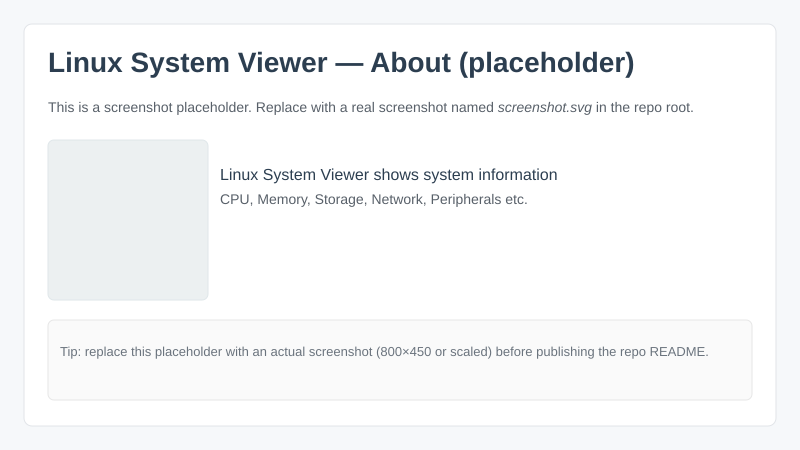

Linux System Viewer — build & install instructions

NOTE: This repository supports DEB-based installation (Debian/Ubuntu) as the officially supported packaging target. You may build from source on other systems, but packaging and automated installation are targeted at DEB.

This project builds the LSV (Linux System Viewer) application using the provided helper script `makeit.sh` and produces a runnable binary and (on Debian/Ubuntu systems) a `.deb` package in the `build/` directory.

Quick workflow (build & DEB install)

1) Prerequisites (example packages on Debian/Ubuntu):

```bash
sudo apt-get update
sudo apt-get install -y build-essential cmake pkg-config git \
	qt6-base-dev qt6-tools-dev qtmultimedia5-dev qt6-linguist-tools \
	lsb-release
```

Note: package names for Qt development tools vary by distribution and version. Ensure you have Qt6 development packages and `lrelease` available for translation compilation.

2) Build (from repository root):

```bash
./makeit.sh
```

- `makeit.sh` configures and builds the project (CMake) and places build artifacts in `build/`.
- Typical outputs you will find in `build/` after a successful run:
	- `build/LSV` — the compiled binary (executable).
	- `build/lsv-<version>.deb` — Debian package (if the packaging step was run and the system supports it).
	- other CPack outputs under `build/_CPack_Packages/` (staging directories).

3) Install (recommended for supported platform — Debian/Ubuntu):

The repository includes `install.sh` to help installing the app system-wide. `install.sh` must be run as root and will prefer installing the `.deb` package if present. If no `.deb` is available it will try to install the built binary and place the desktop and icon files under `/usr` so desktop environments can find them.

Example (DEB install):

```bash
# from repo root, run as root
sudo bash ./install.sh
# or install the generated deb directly
sudo dpkg -i build/lsv-<version>.deb && sudo apt-get -f install -y
```

What `install.sh` does (high level)
- If `build/lsv-*.deb` exists the script installs it using `dpkg -i` and then attempts to fix dependencies with `apt-get -f install`.
- Otherwise the script will: copy `build/LSV` to `/usr/bin/LSV`, copy `lsv.desktop` to `/usr/share/applications/lsv.desktop`, copy any hicolor icons found under `AppDir/usr/share/icons` (or from the `AppDir/` layout) into `/usr/share/icons/hicolor/`, install AppStream metadata to `/usr/share/metainfo/` and refresh desktop/icon/AppStream caches when possible.

Notes & tips
- If the menu entry or icon doesn't appear immediately after install, log out and back in, or run:

```bash
update-desktop-database /usr/share/applications || true
gtk-update-icon-cache -t -f /usr/share/icons/hicolor || true
```

- `install.sh` is intentionally conservative and will not remove existing files outside the ones it installs. Use `uninstall.sh -y` to remove the helper-installed files when needed.

Security
- `install.sh` performs system changes and must be run as root. Inspect the script before running it.

If you want me to add official packaging for additional distributions (RPM/Flatpak/Snap) or to produce CI artifacts, tell me which target and I will prepare a reproducible packaging workflow.
# Linux System Viewer



Official project home & binaries: https://lsv.nalle.no/

Linux System Viewer (LSV) is a small, focused Qt6-based GUI tool that presents
detailed system hardware and software information on Linux. It provides both a
user-friendly overview and technical ("geek") views of components such as CPU,
memory, storage, network, and more.

Key features
- Clean, read-only design: the app gathers information using system utilities and
	presents it without modifying the system.
- Two presentation modes: user-friendly summaries and detailed technical views.
- Packaging: DEB and RPM via CPack for easy distribution on common Linux distros.
- Developer-friendly build options and an opt-in debug logger for safe
	troubleshooting (disabled by default in release builds).

Configuration
- Persistent language selection is stored in `~/.config/LSV/lsv_lang.rc`. The
	application will consult only this file for the saved language choice — no
	other locations are used. A "Change language" dropdown is available in the
	app title bar and a "Reset language" button removes the saved file and
	reverts the UI to English.

Screenshots and binary downloads
- Live demo, releases and packaging builds are published at: https://lsv.nalle.no/

Quickstart — build & run (developer)

1. Build a debug/dev binary with the optional debug logger compiled in:

```bash
cmake -S . -B build_debug -DLSV_ENABLE_DEBUG_LOGGER=ON
cmake --build build_debug -j
LSV_DEBUG=1 ./build_debug/LSV
```

When run with `LSV_DEBUG=1` the debug build writes non-invasive logs to
`$(QDir::tempPath())/lsv-debug.log` (commonly `/tmp/lsv-debug.log`).

2. Build a release binary (no logging compiled in — recommended for releases):

```bash
cmake -S . -B build_release -DLSV_ENABLE_DEBUG_LOGGER=OFF
cmake --build build_release -j
./build_release/LSV
```

3. Create DEB and RPM packages (default packaging uses a release build with no logger):

```bash
./makeit.sh
```

Packaging note — where to find the built artifacts and how to install
------------------------------------------------------------------

The packaging script `./makeit.sh` builds the project and creates distribution
artifacts (DEB/RPM and a small `LSV` runtime bundle) inside the `./LSV`
directory at the repository root. After `./makeit.sh` completes you should see
one or more files under `./LSV/` such as `*.deb`, `*.rpm` and the runtime
executable/bundle named `LSV`.

To install the package you built (example for Debian/Ubuntu):

```bash
# Install the generated .deb (adjust path if your build puts files elsewhere)
sudo apt install ./LSV/*.deb

# Verify the installed executable is available
which LSV
# Should print: /usr/bin/LSV

# Run a quick check (list supported languages or RC path):
/usr/bin/LSV --list-langs
/usr/bin/LSV --rc-path
```

If you prefer not to install a package you can also move the runtime `LSV`
bundle into place manually. After running `./makeit.sh` the `LSV` runtime can
be copied to `/usr/bin` so all users can run it from the menu or command line:

```bash
# Copy runtime to a system-wide location and make it executable
sudo cp ./LSV/LSV /usr/bin/LSV
sudo chown root:root /usr/bin/LSV
sudo chmod 0755 /usr/bin/LSV

# Now you can run it as a normal system command
/usr/bin/LSV
```

Icons & desktop installer (coming soon)
--------------------------------------

For convenience we will provide a small shell helper that installs
icons and the desktop entry (so the application appears in the menus
for GNOME/Cinnamon/MATE/KDE). That helper script will live inside
the `./LSV` directory next to the built artifacts. For now packaging
only places the runtime bundle and packages in `./LSV`; the icon and
desktop installer script will be added in a follow-up change.

If you want to install the desktop file and icon manually right now,
copy `lsv.desktop` to `/usr/share/applications/` and `lsv.png` to a
matching location under `/usr/share/icons/hicolor/` and update the
desktop database (requires sudo). See the repository `lsv.desktop` for
the packaged desktop file we use.


If you need a developer package that includes the logger, build with
`-DLSV_ENABLE_DEBUG_LOGGER=ON` before running `./makeit.sh`, or add the
`--debug-logger` option to the packaging script (not enabled by default).

One-liner examples
- Default (build and package for DEB/RPM):

```bash
./makeit.sh
```

- Build/package without running any runtime tests (opt-out):

```bash
./makeit.sh --norun
```

- Create a developer package that includes the debug logger (runtime still needs LSV_DEBUG=1 to write logs):

```bash
./makeit.sh --debug-logger
```

Logging policy and design
- Default (release): NO logging and no files written by the app.
- Developer/debug builds: logging is compiled in only when the CMake option
	`LSV_ENABLE_DEBUG_LOGGER` is enabled. Runtime logging still requires the
	environment variable `LSV_DEBUG=1` (or `true`) to actually write logs.
- Logs are deliberately written to the system temp dir to avoid persistent
	files in user folders or inside packaged artifacts.

Why this model
- Respect for users' machines: the application is intended to be read-only for
	normal users and will not leave traces or write files unless explicitly
	requested by developers for debugging.

Contributing
- Bug reports, feature requests and patches are welcome. If you plan to add
	functionality that writes persistent data, please discuss it first.

Help translate LSV
------------------

We welcome help translating Linux System Viewer into more languages. If you'd like to contribute translations (for example Icelandic), follow these steps:

1. Install Qt Linguist tools (lupdate / linguist / lrelease). On Debian/Ubuntu: `sudo apt install qttools5-dev-tools qttools5-dev`.
2. Update or open the `.ts` file for the language in `i18n/` (e.g. `i18n/lsv_is.ts`) using Qt Linguist, translate any unfinished entries and mark them as "finished".
3. Run `lrelease i18n/lsv_<code>.ts` to generate the binary `i18n/lsv_<code>.qm` file used at runtime.
4. Commit both the `.ts` and the generated `.qm` to a branch and open a pull request. Example commit message: `i18n(is): complete Icelandic translation`.

Notes for translators
- Keep HTML/markup inside translations unchanged (e.g. `&lt;br&gt;`, links, `%1` placeholders).
- Try to keep technical labels short and consistent with tab names (e.g. "Summary" -> "Yfirlit").
- If you want me to help with an initial draft I can provide a first-pass translation and you can refine it with Qt Linguist.

Contact
- Open a PR on GitHub or email me at the project contact address shown on the project website.

License
- This project is distributed under the GNU General Public License v2 (GPLv2).

Contact / Project home
- Homepage and downloadable binaries: https://lsv.nalle.no/

Enjoy — and thanks for keeping users' machines respected and secure.


This document explains how logging works, how to enable it for development, and how to produce release builds / packages without logging.

